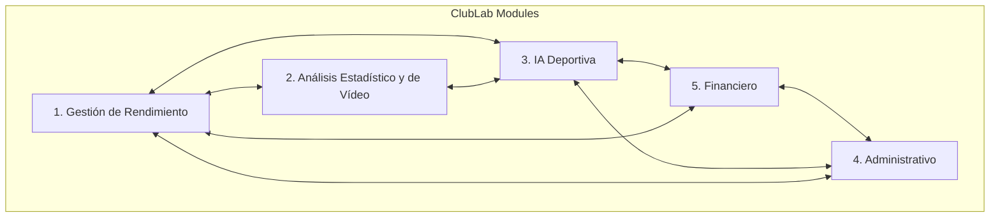

# 02. Product Blueprint

Este documento establece la estructura funcional global de **ClubLab**. Describe los grandes bloques que componen la plataforma, sus relaciones, las capas conceptuales del sistema, la evolución de su modelo de Inteligencia Artificial y la estrategia de seguridad y gobernanza. Su objetivo es asegurar una visión funcional coherente antes de descender a especificaciones técnicas y de arquitectura.

---

## 1. Visión General del Producto

ClubLab se concibe como una plataforma SaaS colaborativa multi-tenant donde **personas y agentes de IA coexisten y trabajan de forma sinérgica**. Centraliza toda la vida deportiva, médica, analítica y administrativa del club en una única base de datos estructurada, eliminando la pérdida de datos y la dispersión en herramientas no especializadas.

---

## 2. Módulos Core de la Plataforma

La plataforma se organiza funcionalmente en torno a cinco grandes módulos interconectados pero con suficiente independencia lógica para ser desplegados y licenciados de forma progresiva:

### 2.1. Módulo 1: Gestión de Rendimiento
El motor operativo diario para el cuerpo técnico y médico del club. Diseñado para optimizar la salud y el rendimiento de los deportistas.
*   **Planificación Integral:** Planificación de sesiones de entrenamiento (grupales e individuales) y partidos estructurados respecto al día de juego (MD-4 a MD+2).
*   **Biblioteca de Ejercicios y Plantillas:** Base de datos de tareas de entrenamiento con objetivos tácticos, material y variables operativas.
*   **Asistencia y Tareas:** Registro de asistencia (`SessionAttendance`) e individualización de tareas complementarias para el jugador.
*   **Wellness y Cargas (RPE):** Cuestionarios diarios de bienestar y percepción subjetiva del esfuerzo para monitorizar fatiga, dolor localizado y carga acumulada.
*   **Experiencia Móvil del Jugador (ClubLab Player):** Interfaz Mobile First, ultra-minimalista e inspirada en iOS para el seguimiento diario del jugador en < 30 segundos (Check-in/Check-out, recomendador contextual *What Should I Do Now?*, Player Timeline y perfil progresivo).
*   **Privacy Center & Gobierno del Dato:** Cumplimiento RGPD con gestión de consentimientos versionados, transparencia de accesos por rol y descarga/supresión de datos (Portabilidad y Olvido).
*   **Gestión de Lesiones (Fisioterapia y Medicina):** Seguimiento confidencial del historial lesional, gravedad, zona anatómica y planes de readaptación física hasta el alta competitiva. *Incluido desde la fase MVP*.

### 2.2. Módulo 2: Análisis Estadístico y de Vídeo
Centraliza el análisis del rendimiento en competición y entrenamiento a través de datos y material audiovisual.
*   **Estadísticas de Partidos:** Registro detallado de eventos de partido, alineaciones, minutos jugados y rendimiento individual de los futbolistas.
*   **Métricas de Rendimiento:** Consolidación de datos físicos y tácticos históricos para análisis de tendencias del equipo e individuales.
*   **Integración de Vídeo:** Almacenamiento, etiquetado y vinculación de grabaciones de vídeo con eventos específicos del partido o sesiones de entrenamiento para facilitar el análisis visual (debriefings tácticos).

### 2.3. Módulo 3: IA Deportiva
El cerebro analítico que potencia la automatización y la generación de inteligencia accionable.
*   **Estrategia de Datos Semántica y de Grafo:** La información no se limita a un almacenamiento relacional clásico. A futuro, se introduce una **ontología y semántica basada en una estructura de datos de tipo grafo**, permitiendo mapear relaciones complejas y contextuales entre jugadores, tácticas, lesiones, ejercicios y rendimiento.
*   **Sistemas RAG (Generación Aumentada por Recuperación):** Uso de RAG sobre la base de conocimiento estructurada (incluyendo el grafo semántico) para responder de forma exacta y contextualizada a preguntas del staff técnico.
*   **Modelos Reentrenados/Específicos:** Modelos de lenguaje adaptados y entrenados con terminología de fútbol y metodologías de entrenamiento para redactar planes de sesión y análisis tácticos con alto rigor deportivo.
*   **Persistencia de Insights (ai_analyses):** Historial persistente de análisis de IA para evitar regeneraciones costosas y construir una memoria histórica deportiva del club.

### 2.4. Módulo 4: Administrativo
La capa de gestión organizativa e institucional del club.
*   **Socios y Abonados:** Base de datos de socios, carnets, control de accesos e histórico de afiliación.
*   **Academia e Inscripciones:** Gestión de las escuelas de fútbol base, inscripciones online y control documental de deportistas y tutores.
*   **Fichas Federativas:** Registro y control de documentación oficial para el alta de licencias en las federaciones correspondientes.
*   **Inventario y Material:** Control de existencias de material de entrenamiento (GPS, balones, petos, etc.) y equipación oficial asignada al staff y jugadores.

### 2.5. Módulo 5: Financiero
Control monetario y cumplimiento fiscal, con especial atención a la digitalización.
*   **Cobro de Cuotas:** Gestión automatizada de recibos y cobros recurrentes de la academia o cuotas de socios.
*   **Pasarelas de Pago:** Integración con plataformas bancarias (Stripe, SEPA) para la domiciliación y cobro digital.
*   **Facturación Digital (Modern Compliance):** Gestión de facturas diseñada bajo estándares modernos de digitalización fiscal (adaptado a leyes como TicketBAI / Ley Crea y Crece en España) para evitar la obsolescencia y asegurar la validez legal del club.
*   **Subvenciones y Patrocinadores:** Control de presupuestos, justificación de subvenciones públicas y seguimiento de contratos de patrocinadores comerciales.

---

## 3. Capas de la Plataforma

Conceptualmente, la plataforma se estructura en cinco capas para garantizar un desarrollo desacoplado y mantenible:

1.  **Capa de Presentación (UI/UX):** Interfaz web y móvil responsiva (Next.js + Tailwind CSS) optimizada para su uso rápido a pie de campo o en la oficina del club.
2.  **Capa de Autenticación y Autorización:** Gestión de accesos y sesiones unificada con Supabase Auth.
3.  **Capa de Gateway y APIs:** APIs RESTful que canalizan las solicitudes del cliente de forma segura mediante validación estricta de datos de entrada (Zod).
4.  **Capa de Datos y Lógica de Negocio:** Lógica en servidor y base de datos (PostgreSQL en Supabase) protegida por políticas de seguridad RLS a nivel de fila.
5.  **Capa de Inteligencia Artificial (AI Engine):** Orquestador de agentes de IA conectados a modelos de lenguaje (Gemini) para procesar el modelo semántico del club.

---

## 4. Filosofía AI First / Híbrida: La evolución de la IA

La integración de la Inteligencia Artificial en ClubLab no es estática, sino una curva evolutiva que respeta la madurez técnica del usuario y de la plataforma:

*   **Fase Inicial (Widgets Especializados de IA):** Herramientas contextuales incrustadas en pantallas clave. 
    *   *Ejemplo:* Un botón en la ficha de lesión que redacta un resumen del plan de readaptación física; un widget en el creador de entrenamientos que sugiere tres ejercicios de posesión basados en los conceptos tácticos elegidos.
*   **Fase Avanzada (Copiloto Conversacional Centralizado):** Interfaz global de chat donde el usuario puede interaccionar con toda la plataforma en lenguaje natural.
    *   *Ejemplo:* El entrenador pregunta en el chat: *"¿Qué jugadores del equipo Cadete han reportado molestias de rodilla esta semana y cuántos minutos de entrenamiento acumulan?"*. La IA genera una respuesta holística consolidando datos médicos, wellness y de asistencia, presentando un enlace directo a sus perfiles.

En todo momento, la toma de decisiones críticas (dar el alta médica a un jugador lesionado, aplicar una sanción o validar un fichaje) es prerrogativa exclusiva del usuario humano.

---

## 5. Seguridad, Privacidad y Gobernanza

La confidencialidad es crítica para ganar la confianza de los clubes, especialmente en el tratamiento de menores de edad.

*   **Aislamiento Multi-tenant:** Los datos deportivos, médicos e institucionales de un club están lógicamente aislados de los demás. Ningún club puede consultar o alterar la información de otro.
*   **Gobernanza de Accesos (RBAC Flexible):**
    *   El acceso se restringe mediante políticas de seguridad de base de datos (RLS).
    *   Para adaptarse a la realidad del fútbol modesto, **el sistema permite la asignación de múltiples roles concurrentes a un mismo usuario** (ej. un usuario puede operar con el rol de `coach` y `physical_coach` simultáneamente, unificando sus permisos).
*   **Privacidad del Menor y Soberanía:**
    *   Recogida obligatoria del consentimiento informado de los tutores legales (`data_sharing_consent`) para el tratamiento de datos biométricos.
    *   Soporte nativo para la anonimización de perfiles en análisis generales y exportaciones.

---

## 6. Roadmap de Desarrollo de Alto Nivel

El desarrollo de ClubLab se divide en tres fases principales para asegurar un lanzamiento estructurado:

### Fase 1: MVP Core (Cimientos Deportivos, Lesiones y Scouting Inicial)
*   Estructura multi-tenant básica y registro organizativo (onboarding).
*   Gestión de plantillas, campogramas y fichas de jugadores.
*   **Gestión de Rendimiento MVP:** Planificación de sesiones, asistencia, wellness, cargas RPE y **gestión de lesiones completa** (médico/fisio).
*   **Introducción al Scouting:** Ficha básica de candidatos, registro de perfiles observados e informes sencillos de captación.
*   Gobernanza mediante RBAC flexible con soporte de múltiples roles por usuario.
*   Administración y gestión financiera básica del club (socios y cuotas iniciales).

### Fase 2: Intelligence & AI Core (El Cerebro Deportivo y Vídeo)
*   **IA Deportiva avanzada:** Integración del motor de IA con sistemas RAG sobre la base de conocimiento y widgets especializados contextuales.
*   Historial persistente de análisis de IA (`ai_analyses`).
*   **Análisis Estadístico y de Vídeo:** Módulo completo para estadísticas de partido, métricas individuales e integración de clips audiovisuales tácticos.
*   Primeros pasos para la **ontología de conocimiento y semántica basada en grafos** para conectar entidades de forma compleja.
*   Alertas predictivas de riesgo de lesión.

### Fase 3: SaaS Scale & Finanzas Avanzadas (El Ecosistema Comercial)
*   **Módulo Financiero completo:** Facturación digital de última generación (e-factura obligatoria/TicketBAI/Crea y Crece) e integración de pasarelas de pago SEPA/Stripe.
*   Gestión avanzada de socios, abonados y automatizaciones completas de cobro de cuotas e inscripciones de academia.
*   Gestión avanzada de patrocinadores y subvenciones.
*   Auditoría de ciberseguridad externa y certificaciones oficiales de protección de datos.
