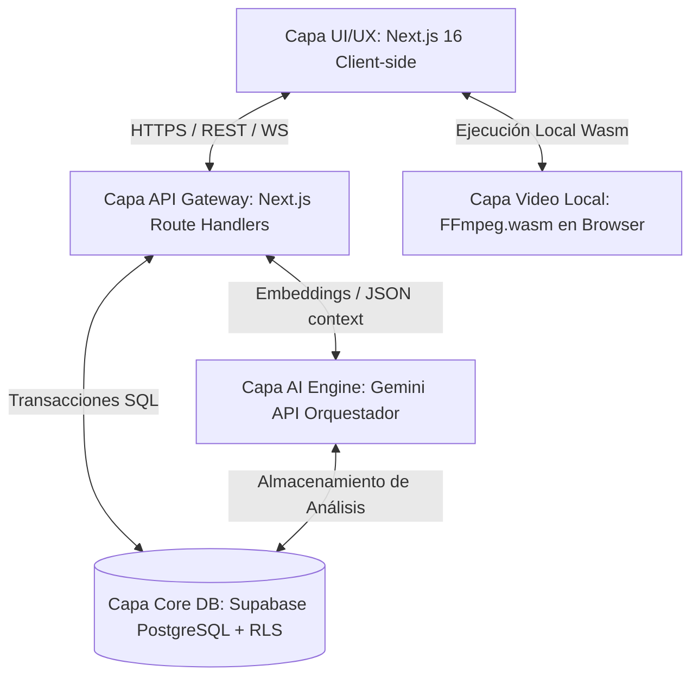
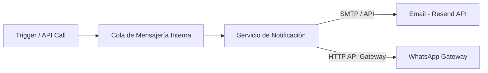

# 03. Product Architecture

Este documento define la arquitectura técnica de **ClubLab**, traduciendo el Blueprint funcional a una estructura de sistemas, bases de datos y flujos de información. Prioriza el control de costes y la eficiencia de cómputo en la nube mediante técnicas de procesamiento en el cliente y un modelo de datos híbrido.

---

## 1. Dominios y Bounded Contexts

ClubLab está diseñado siguiendo los principios de *Domain-Driven Design* (DDD) para asegurar que los límites funcionales se reflejen en la estructura del código y la base de datos:

```text
+-----------------------------------------------------------------------------------+
|                                  CLUBLAB MONOLITH                                 |
|                                                                                   |
|  +--------------------+  +----------------------+  +---------------------------+  |
|  |    RENDIMIENTO     |  | ESTADÍSTICA Y VÍDEO  |  |       IA DEPORTIVA        |  |
|  | - Wellness / RPE   |  | - Estadísticas       |  | - RAG & Prompting         |  |
|  | - Planificación    |  | - Corte local        |  | - Grafo Semántico         |  |
|  | - Lesiones (MVP)   |  |   (FFmpeg.wasm)      |  |   (PostgreSQL/pgvector)   |  |
|  +--------------------+  +----------------------+  +---------------------------+  |
|                                                                                   |
|            +--------------------+            +--------------------+               |
|            |   ADMINISTRATIVO   |            |     FINANCIERO     |               |
|            | - Socios           |            | - Cuotas / SEPA    |               |
|            | - Academia / Fichas|            | - Facturación Elec.|               |
|            +--------------------+            +--------------------+               |
+-----------------------------------------------------------------------------------+
```

1.  **Contexto de Rendimiento:** Centraliza la planificación física e historial médico. Tablas principales: `training_sessions`, `wellness_entries`, `rpe_entries`, `injuries`.
2.  **Contexto de Estadística y Vídeo:** Gestiona la competición y la edición audiovisual local. Tablas principales: `matches`, `match_stats`, `video_clips`.
3.  **Contexto de IA Deportiva:** Administra la persistencia de análisis semánticos y el grafo de conocimiento. Tablas principales: `ai_analyses` (con embeddings vectoriales).
4.  **Contexto Administrativo:** Controla la estructura social y organizativa del club. Tablas principales: `organizations`, `clubs`, `seasons`, `teams`, `players`.
5.  **Contexto Financiero:** Administra la contabilidad digital, cuotas y cobros. Tablas principales: `subscriptions`, `invoices`, `memberships_payments`.

---

## 2. Arquitectura por Capas

La plataforma utiliza una arquitectura por capas desacoplada que facilita la escalabilidad y mantiene el núcleo transaccional protegido:



*   **Capa UI/UX (Frontend):** Next.js 16 (React 19, Tailwind CSS v4) enfocado en renderizar componentes interactivos rápidos y adaptados a móvil. El procesamiento de vídeo pesado se delega a esta capa mediante WebAssembly.
*   **Capa API Gateway:** Route Handlers de Next.js que actúan como capa intermedia de seguridad, validando datos de entrada vía **Zod** y gestionando integraciones externas (Stripe, WhatsApp).
*   **Capa Core DB (Supabase):** PostgreSQL con políticas de seguridad de fila (RLS) estrictas para garantizar el multi-tenant.
*   **Capa AI Engine:** Consumo optimizado del modelo Gemini mediante pipelines RAG que operan sobre snapshots JSON estructurados en la base de datos.

---

## 3. Modelo Multi-tenant e Isolation (RLS)

El aislamiento de datos de cada club cliente se realiza a nivel lógico en la base de datos PostgreSQL de Supabase mediante RLS (Row Level Security).

### Funciones Helpers de Aislamiento
La seguridad se apoya en dos funciones seguras que obtienen el contexto del usuario autenticado:
1.  `auth_org_id()`: Retorna el UUID de la organización asociada al usuario activo (`auth.uid()`).
2.  `auth_user_role()`: Retorna el rol del usuario para controles de permisos en consultas.

### Ejemplo de Política RLS Standard (Tabla `players`):
```sql
ALTER TABLE players ENABLE ROW LEVEL SECURITY;

CREATE POLICY "org_isolation" ON players FOR ALL
  TO authenticated
  USING (organization_id = auth_org_id());
```

---

## 4. Evolución de Permisos: RBAC Multi-rol

Para responder a la realidad del fútbol modesto (donde un usuario puede ser primer entrenador y preparador físico a la vez), la arquitectura actual debe evolucionar de un modelo de "un único rol por usuario-org" a uno de **roles concurrentes**.

### Refactorización del Esquema y Restricciones
*   **Antes (Esquema Original):** La tabla `user_organization_roles` contiene una restricción `UNIQUE (user_id, organization_id)`.
*   **Después (Esquema Propuesto):** Se elimina esta restricción única y se reemplaza por `UNIQUE (user_id, organization_id, role)`. Esto permite múltiples filas para el mismo usuario y club, una por cada rol que asuma.

### Adaptación de Funciones SQL de RLS
Debemos modificar la función que obtiene el rol para que retorne un arreglo de texto (`TEXT[]`) en lugar de un único `TEXT`:

```sql
CREATE OR REPLACE FUNCTION auth_user_roles()
RETURNS TEXT[] AS $$
  SELECT COALESCE(ARRAY_AGG(role), ARRAY[]::TEXT[])
  FROM user_organization_roles
  WHERE user_id = auth.uid();
$$ LANGUAGE sql SECURITY DEFINER STABLE;
```

Las políticas de RLS que verifiquen roles de administración se reescriben para usar coincidencia de arrays (operador `&&`):
```diff
- USING (id = auth_org_id() AND auth_user_role() IN ('club_admin', 'super_admin'));
+ USING (id = auth_org_id() AND auth_user_roles() && ARRAY['club_admin', 'super_admin']);
```

---

## 5. Estrategia de Grafo Semántico de Bajo Coste

Para evitar la duplicidad de costes de infraestructura de un motor de grafos dedicado en la fase inicial, se implementa una **arquitectura híbrida de bajo coste**:

1.  **Modelado Relacional de Grafo en PostgreSQL:**
    *   Se definen dos tablas ligeras: `semantic_nodes` (entidades: jugador, ejercicio, lesión, concepto táctico) y `semantic_edges` (relaciones: "PROPENSO_A", "COMPLEMENTA_CON", "EJECUTADO_EN") indexadas para búsquedas de profundidad rápida.
2.  **Capa de Embeddings (pgvector):**
    *   Se utiliza la extensión `pgvector` en Supabase para almacenar la representación semántica de cada nodo.
    *   Búsquedas de similitud o relaciones contextuales se resuelven mediante queries SQL utilizando distancia coseno.
3.  **Migración Futura (Fase 2/3):**
    *   Cuando el volumen y el presupuesto lo requieran, esta estructura de nodos y aristas se migrará a un motor nativo ligero como **Memgraph** (open source y de bajo consumo en VPS propio) o instancias serverless de Neo4j AuraDB.

---

## 6. Procesamiento de Vídeo Local (Zero-Cloud-Cost)

Para ofrecer herramientas de análisis audiovisual útiles a los entrenadores sin incurrir en costes prohibitivos de transferencia de datos y procesamiento en servidores en la nube:

*   **Procesamiento Client-Side con WebAssembly (FFmpeg.wasm):**
    *   El entrenador carga el archivo de vídeo del partido directamente en su navegador.
    *   Mediante `ffmpeg.wasm`, la interfaz permite al usuario definir puntos de corte (timestamps de jugadas destacadas) y renderizar los clips directamente en la CPU local del ordenador del usuario.
*   **Almacenamiento Local Híbrido:**
    *   Los clips resultantes se guardan en el sistema de archivos local del entrenador (File System Access API) o se descargan de inmediato.
    *   Para clubes con presupuesto o almacenamiento propio, se permite sincronizar con servidores locales del club (NAS) o utilizar la cuota básica de Supabase Storage.

---

## 7. Servicios Compartidos de Notificaciones

Para garantizar el cumplimiento de tareas físicas (Wellness/RPE) y avisos de convocatorias, la arquitectura incorpora un microservicio de notificaciones asíncronas:



1.  **Canal Email (Resend):** Utilizado para alertas administrativas, restablecimiento de contraseñas y resúmenes semanales. Integrado de forma nativa a través de API REST.
2.  **Canal WhatsApp (Enfoque de Coste Optimizado):**
    *   *Fase 1:* Puente web de bajo coste (WhatsApp Web API local autohospedado en un VPS del desarrollador) que emula la mensajería a través de un número del propio club sin costes por mensaje.
    *   *Fase 2:* Migración a la API oficial de Twilio para WhatsApp a medida que el club escale y requiera certificación de marca y mayor volumen.
