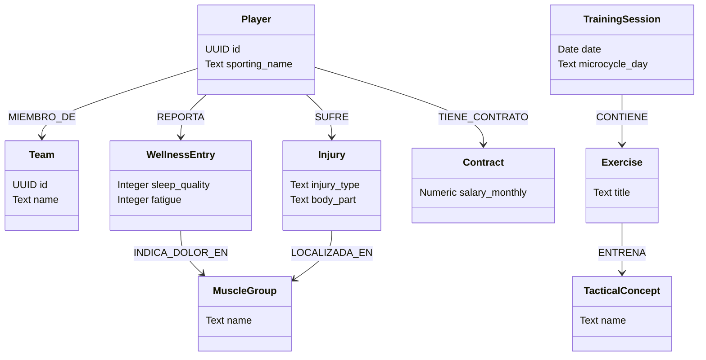

# 04. Knowledge Model

Este documento define el modelo de conocimiento conceptual, relacional y semántico (ontología) de **ClubLab**. Sirve como el mapa de datos maestro sobre el cual opera la lógica de negocio y, fundamentalmente, sobre el cual los agentes de Inteligencia Artificial (a través de RAG y motores de grafos) razonan, asocian y extraen insights de valor deportivo y administrativo.

---

## 1. Entidades del Dominio y Atributos

El modelo de conocimiento está compuesto por las siguientes entidades agrupadas por áreas lógicas:

### 1.1. Núcleo Deportivo e Institucional
*   **Club:** La institución deportiva matriz.
    *   *Atributos:* `id` (UUID), `organization_id` (UUID), `name` (Text), `founded_year` (Integer), `country` (Text), `city` (Text), `logo_url` (Text).
*   **Temporada (Season):** Segmentación temporal de la competición.
    *   *Atributos:* `id` (UUID), `club_id` (UUID), `name` (Text, ej. "2026/27"), `start_date` (Date), `end_date` (Date), `is_active` (Boolean).
*   **Equipo (Team):** Grupo de deportistas específico dentro de una categoría.
    *   *Atributos:* `id` (UUID), `club_id` (UUID), `season_id` (UUID), `name` (Text), `category` (Text, ej. "Cadete A"), `gender` (Text: `male`, `female`, `mixed`), `color` (Text/Hex).
*   **Jugador (Player):** Perfil del deportista.
    *   *Atributos:* `id` (UUID), `organization_id` (UUID), `first_name` (Text), `last_name` (Text), `sporting_name` (Text), `date_of_birth` (Date), `nationality` (Text), `dominant_foot` (Text: `right`, `left`, `both`), `height_cm` (Numeric), `weight_kg` (Numeric), `avatar_url` (Text), `anonymized_id` (Text), `data_sharing_consent` (Boolean), `physical_status` (Text: `green`, `yellow`, `red`), `availability_status` (Text: `available`, `control`, `not_available`).
*   **Miembro del Staff (Staff Member):** Perfil del cuerpo técnico o directivo.
    *   *Atributos:* `id` (UUID), `user_id` (UUID), `organization_id` (UUID), `role` (Text: `head_coach`, `coach`, `physical_coach`, `physio`, etc.).

### 1.2. Planificación, Rendimiento y Salud
*   **Sesión (TrainingSession):** Evento planificado de entrenamiento o partido.
    *   *Atributos:* `id` (UUID), `team_id` (UUID), `title` (Text), `date` (Date), `duration_min` (Integer), `session_type` (Text: `training`, `match`, `recovery`, `gym`), `microcycle_day` (Text: `MD-4` a `MD+2`), `planned_load` (Text: `low` a `high`), `status` (Text: `planned`, `completed`, `cancelled`).
*   **Ejercicio (Exercise):** Tarea metodológica de entrenamiento.
    *   *Atributos:* `id` (UUID), `title` (Text), `description` (Text), `category` (Text), `difficulty` (Text: `beginner`, `intermediate`, `advanced`), `tactical_concepts` (Text[]), `equipment` (JSONB).
*   **Wellness Check-in (PlayerWellnessCheckin):** Autoevaluación diaria adaptativa (< 30s) de calidad del sueño, fatiga, estado de ánimo, dolor muscular, nivel de estrés y molestias focalizadas.
*   **Carga de Sesión (RPEEntry):** Valoración subjetiva del esfuerzo de la sesión (< 20s) con post-feeling y reporte de molestias.
*   **Recomendación al Jugador (PlayerRecommendation):** Prescripción activa del staff técnico/médico (Fuerza, Prevención, Activación, Movilidad, Recuperación) vinculada a ejercicios de la plataforma.
*   **Consentimientos RGPD (UserDataConsent):** Registro versionado y auditable de consentimientos de datos de salud y analítica.
*   **Solicitudes de Privacidad (PlayerPrivacyRequest):** Solicitudes de portabilidad (descarga de datos) y derecho al olvido/supresión.
*   **Lesión (Injury):** Ficha médica de diagnóstico y recuperación.
    *   *Atributos:* `id` (UUID), `player_id` (UUID), `injury_type` (Text), `body_part` (Text), `body_side` (Text: `left`, `right`, `central`), `severity` (Text: `low`, `medium`, `high`), `status` (Text: `active`, `readaptation`, `resolved`), `occurred_date` (Date), `expected_return` (Date), `treatment_plan` (Text).
*   **Test Físico (PhysicalTestResult):** Métricas cuantitativas de rendimiento.
    *   *Atributos:* `id` (UUID), `player_id` (UUID), `test_id` (UUID), `date` (Date), `value` (Numeric).

### 1.3. Inteligencia y Audiovisual
*   **Informe de Captación (ScoutReport):** Evaluación de ojeadores sobre un candidato externo.
    *   *Atributos:* `id` (UUID), `candidate_id` (UUID), `scouted_by` (UUID), `overall_rating` (Numeric), `notes` (Text).
*   **Candidato (Candidate):** Perfil de un jugador externo bajo observación.
    *   *Atributos:* `id` (UUID), `first_name` (Text), `last_name` (Text), `current_club` (Text), `age` (Integer), `positions` (Text[]), `signing_status` (Text: `signed`, `close`, `difficult`).
*   **VideoClip:** Fragmento corto de vídeo etiquetado de un partido.
    *   *Atributos:* `id` (UUID), `match_id` (UUID), `video_url` (Text), `start_timestamp` (Integer), `end_timestamp` (Integer), `tags` (Text[]).
*   **Análisis de IA (AIAnalysis):** Reportes deportivos u organizativos generados por LLM.
    *   *Atributos:* `id` (UUID), `entity_type` (Text: `player`, `team`, `session`), `entity_id` (Text), `analysis_type` (Text), `result_text` (Text), `result_structured` (JSONB).

### 1.4. Administrativo y Financiero (Preparación a Futuro)
*   **Contrato (Contract):** Relación legal y económica de un jugador o staff.
    *   *Atributos:* `id` (UUID), `player_id` (UUID), `start_date` (Date), `end_date` (Date), `salary_monthly` (Numeric), `renewal_clause` (Text), `status` (Text: `active`, `pending`, `terminated`).
*   **Patrocinador (Sponsor):** Entidad comercial vinculada al club.
    *   *Atributos:* `id` (UUID), `name` (Text), `contract_value` (Numeric), `start_date` (Date), `end_date` (Date).
*   **Factura (Invoice):** Documento fiscal del club (Listo para e-facturación).
    *   *Atributos:* `id` (UUID), `organization_id` (UUID), `client_name` (Text), `amount` (Numeric), `tax_id` (Text), `status` (Text: `paid`, `pending`), `xml_hash` (Text, para TicketBAI/Crea y Crece).
*   **Subvención (Subsidy):** Ayuda económica pública bajo seguimiento.
    *   *Atributos:* `id` (UUID), `amount` (Numeric), `grantor` (Text), `justification_deadline` (Date), `status` (Text).

---

## 2. Taxonomía Táctica de Conceptos

Para que el modelo de conocimiento exponga un lenguaje deportivo idéntico al de un entrenador, se define una taxonomía de principios tácticos que indexa a los Ejercicios (`Exercise`) y Sesiones (`TrainingSession`):

```text
CONCEPTOS TÁCTICOS (Jerarquía de Grafo)
├── Fase Ofensiva
│   ├── Amplitud (Apertura de campo)
│   ├── Profundidad (Pases a la espalda)
│   └── Desmarque de Ruptura / Apoyo
├── Fase Defensiva
│   ├── Basculación (Desplazamiento en bloque)
│   ├── Vigilancia Defensiva
│   └── Presión Tras Pérdida
├── Transición Defensiva-Ofensiva (Contraataque rápido)
├── Transición Ofensiva-Defensiva (Repliegue / Presión)
└── ABP (Acciones a Balón Parado)
    ├── Saques de Esquina
    └── Faltas Laterales
```

---

## 3. Modelo Anatómico de Lesiones y Molestias

El modelo semántico define las regiones del cuerpo para que la IA asocie automáticamente dolores reportados en el cuestionario Wellness (`localized_discomfort`) con las lesiones reales (`Injury`):

*   **Zonas Musculares:** `Isquiotibiales`, `Cuádriceps`, `Gemelos`, `Aductores`, `Glúteos`, `Abdominales`, `Psoas`.
*   **Zonas Articulares:** `Tobillo`, `Rodilla`, `Cadera`, `Pubis`, `Hombro`.
*   **Laterales:** `Izquierdo`, `Derecho`, `Bilateral`, `Central`.

---

## 4. Ontología Deportiva (Modelo en Grafo Semántico)

A nivel semántico, las entidades se conectan mediante relaciones dirigidas que representan el flujo deportivo. Esto compone el grafo de conocimiento del club:



### Relaciones Clave del Grafo (Semántica de Aristas):
1.  `(Player)-[:MIEMBRO_DE]->(Team)`: Vincula al deportista con su equipo.
2.  `(Player)-[:REPORTA]->(WellnessEntry)`: Historial subjetivo de fatiga.
3.  `(Player)-[:SUFRE]->(Injury)`: Estado de salud.
4.  `(Injury)-[:LOCALIZADA_EN]->(MuscleGroup)`: Asociación anatómica.
5.  `(WellnessEntry)-[:INDICA_DOLOR_EN]->(MuscleGroup)`: Correlación entre quejas diarias del jugador y anatomía muscular.
6.  `(TrainingSession)-[:CONTIENE]->(Exercise)`: Estructura del entrenamiento.
7.  `(Exercise)-[:ENTRENA]->(TacticalConcept)`: Vínculo metodológico.
8.  `(Player)-[:TIENE_CONTRATO]->(Contract)`: Vinculación contractual y financiera.

---

## 5. Mecanismo de Inferencia y RAG Semántico

El motor de IA Deportiva (Módulo 3) procesa consultas de lenguaje natural cruzando las aristas de este grafo semántico:

### Ejemplo de Inferencia Cruzada por Grafo:
*   **Consulta del Entrenador:** *“¿Qué ejercicios hemos hecho esta semana que entrenen el 'Desmarque' y si algún jugador que los hizo tiene molestias de rodilla?”*
*   **Resolución Semántica del Grafo:**
    1.  Identificar el Nodo `TacticalConcept` ("Desmarque").
    2.  Buscar hacia atrás: `(Exercise)-[:ENTRENA]->(TacticalConcept)` ejecutados en la semana en `TrainingSession`.
    3.  Identificar la lista de nodos `Player` con asistencia registrada en esas sesiones.
    4.  Para esa lista de jugadores, buscar en sus `WellnessEntry` recientes si `(WellnessEntry)-[:INDICA_DOLOR_EN]->(MuscleGroup)` tiene como valor "Rodilla".
    5.  Consolidar el resultado y presentarlo al entrenador.
