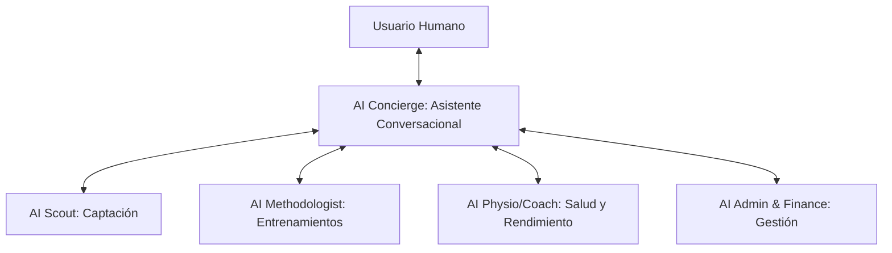

# 05. AI Operating Model

Este documento define el modelo operativo de la Inteligencia Artificial dentro de **ClubLab**. La IA no se concibe como una simple utilidad o botón de procesamiento, sino como un **miembro digital integrado en el cuerpo técnico y administrativo** del club. Este modelo establece las responsabilidades, las herramientas, la gobernanza de privacidad cruzada, el flujo conversacional y el aprendizaje continuo de los agentes de IA.

---

## 1. El Paradigma de Coexistencia: Copiloto Adaptativo

La interacción entre personas y agentes de IA en ClubLab se rige bajo los siguientes principios:
*   **Human-in-the-Loop:** La IA analiza, propone, automatiza y alerta, pero la **toma de decisiones final e institucional (altas médicas, contrataciones, gastos, cambios de entrenamiento) siempre requiere validación humana**.
*   **Orquestación Unificada:** Los agentes de IA comparten una base de conocimiento común (el Grafo Semántico del club) para evitar silos de información entre departamentos.

---

## 2. Tipología de Agentes de Staff (AI Staff Members)

El sistema integra cuatro agentes especializados coordinados por un asistente central:



### 2.1. AI Scout (Ojeador Virtual)
*   **Responsabilidad:** Procesar y analizar informes de candidatos externos, comparar rendimientos con la plantilla actual y mantener al día la base de datos de captación.
*   **Capacidades:** Redactar resúmenes ejecutivos de jugadores, clasificar perfiles por aptitudes tácticas (taxonomía) y buscar similitudes semánticas en la base de datos de candidatos.

### 2.2. AI Methodologist (Metodólogo Virtual)
*   **Responsabilidad:** Asistir en la creación de sesiones de entrenamiento coherentes con el microciclo del equipo y la metodología del club.
*   **Capacidades:** Sugerir ejercicios específicos de la biblioteca del club según los objetivos tácticos definidos para el día; estructurar plantillas de sesión reutilizables; evaluar la variedad de las tareas programadas en la temporada.

### 2.3. AI Physio/Coach Copilot (Preparador y Médico Virtual)
*   **Responsabilidad:** Monitorizar la salud, bienestar y carga de esfuerzo percibida en el día a día para prevenir lesiones y optimizar el rendimiento físico.
*   **Capacidades:** Calcular ratios de carga aguda/crónica a nivel individual y grupal, correlacionar molestias físicas con ejercicios realizados y sugerir la readaptación o descanso preventivo de jugadores con alertas en semáforo (`green`, `yellow`, `red`).

### 2.4. AI Admin & Finance (Administrador Virtual)
*   **Responsabilidad:** Automatizar la gestión operativa, control fiscal de cobros, facturación digital y mantenimiento administrativo de la escuela/academia.
*   **Capacidades:** Rastrear impagos de cuotas mensuales de socios/padres, verificar consistencia fiscal en XML de facturas generadas, generar reportes del estado de justificación de subvenciones públicas y redactar avisos informativos.

---

## 3. Gobernanza de Datos y Agentes Interfuncionales (Cross-Functional)

Para cumplir con el Reglamento General de Protección de Datos (RGPD) y proteger la confidencialidad médica y financiera, el modelo operativo implementa un sistema de **seguridad y enmascaramiento inteligente de datos**:

### 3.1. Heredabilidad de Permisos (RBAC de Agentes)
Por defecto, cuando un usuario interactúa con un agente de IA, este **hereda de forma estricta los permisos de rol del usuario**. 
*   *Ejemplo:* Si un entrenador asistente interactúa con el `AI Physio/Coach`, el agente tiene vetada la consulta de las notas médicas confidenciales (`medical_notes` escritas por el fisioterapeuta).

### 3.2. Agentes Interfuncionales (Cross-Functional)
Cuando un agente de IA necesita cruzar datos protegidos para responder una consulta deportiva, opera bajo un esquema de **síntesis inteligente y enmascaramiento de raw data**:

```text
[Entrenador]
    │  Petición: "¿Está el Jugador X listo para competir 45 minutos?"
    ▼
[Agente Interfuncional]
    │  Consulta Interna (Acceso Autorizado al Raw Data médico):
    │  - Lee notas médicas: "Rotura fibrilar de 2cm en el isquiotibial izquierdo..."
    │  - Lee historial de RPE y Wellness recientes.
    │  Aplica lógica deportiva/médica
    ▼
[Respuesta Sintetizada y Enmascarada]
    "El jugador ha completado las fases de readaptación física con buena tolerancia.
     Deportivamente está listo para jugar como máximo 20-30 minutos de baja intensidad. 
     (Nota: Los detalles médicos están restringidos al departamento de fisioterapia)."
```

Este mecanismo permite que la IA aporte inteligencia útil para la toma de decisiones del cuerpo técnico sin violar la privacidad del historial clínico o contractual del futbolista.

---

## 4. Automatizaciones Autónomas en Segundo Plano (Cron Tasks)

Los agentes de IA no solo responden bajo demanda, sino que ejecutan tareas programadas en segundo plano de manera autónoma para mantener ClubLab actualizado y alerta:

1.  **Actualización Autónoma de Resultados y Estadísticas:**
    *   *Frecuencia:* Posterior a partidos oficiales o carga de datos externos.
    *   *Proceso:* La IA procesa y parsea actas de partidos o archivos de proveedores estadísticos, estructurando los eventos del partido y actualizando la base de datos de rendimiento del club de forma autónoma.
2.  **Recálculo de Alertas Físicas y Cargas:**
    *   *Frecuencia:* Diaria (ej. 23:00 hrs).
    *   *Proceso:* El `AI Physio/Coach` analiza los registros de Wellness y RPE del día, evalúa anomalías físicas y actualiza proactivamente el panel de alertas en el dashboard.
3.  **Generación Proactiva de Recomendaciones:**
    *   *Frecuencia:* Semanal (antes del inicio del microciclo).
    *   *Proceso:* El `AI Methodologist` evalúa las lesiones activas y las cargas acumuladas para recomendar qué tipo de ejercicios programar en el microciclo entrante.
4.  **Actualización de Informes de Scouting:**
    *   *Frecuencia:* Nocturna.
    *   *Proceso:* El `AI Scout` consolida las nuevas observaciones de candidatos externos y actualiza las prioridades en el dashboard de captación.
5.  **Envío de Recordatorios de Tareas (WhatsApp/Email):**
    *   *Frecuencia:* Diaria (ej. 10:00 AM para wellness).
    *   *Proceso:* El `AI Admin` rastrea quiénes no han rellenado su wellness del día y envía notificaciones directas personalizadas por WhatsApp/Email de forma automatizada.

---

## 5. Ciclo de Retroalimentación y Aprendizaje Continuo (Feedback Loop)

Para asegurar que la IA del club mejore con el uso y se adapte al estilo del cuerpo técnico, se define un bucle de aprendizaje basado en la persistencia de datos de la tabla `ai_analyses`:

```text
[Generación de Análisis IA] 
       │ 
       ▼
[Uso y Corrección por Usuario] ──► Calificación (1-5) e indicación de errores en UI.
       │ 
       ▼
[Persistencia en Base de Datos] ──► Almacenamiento en `quality_rating` y `feedback_notes`.
       │ 
       ▼
[Optimización de Contexto / RAG] ──►
       * Los análisis calificados con 5/5 se inyectan como Few-Shot Examples en futuros prompts.
       * Los análisis calificados con <3/5 alimentan un dataset de correcciones.
       * Fase avanzada: Ajuste fino (fine-tuning) de modelos locales mediante el dataset de correcciones.
```

Este ciclo de retroalimentación garantiza que el "cerebro deportivo" de ClubLab adquiera el vocabulario específico y respete los criterios tácticos singulares del club cliente de manera orgánica con el paso de las temporadas.
